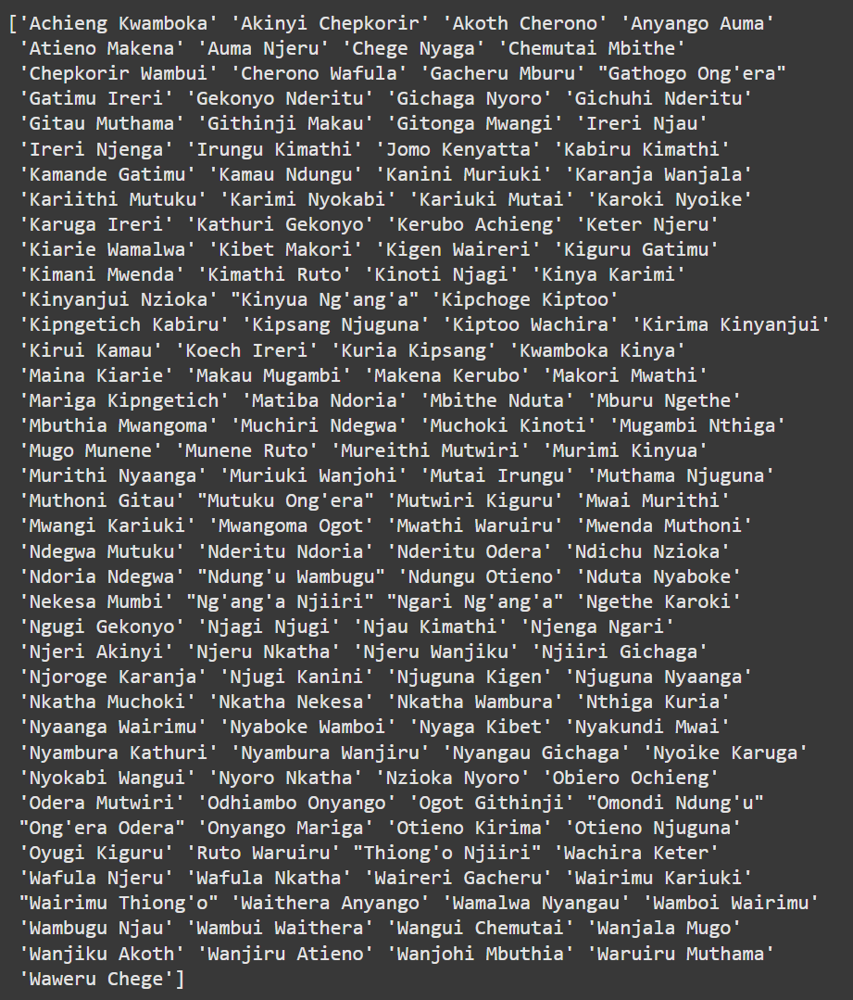

# Week 1 Day 3 Assignment

## 1. Sort Agent Names in Alphabetical Order (A-Z)
To sort the agent names in alphabetical order from the `train_data_cross-sell.csv` file, you can use the following Python code snippet:

```python
# Import the pandas library
import pandas as pd

# Load the data from the CSV file
df = pd.read_csv('train_data_cross-sell.csv', encoding='latin-1')

# Sort the agent names in alphabetical order and get unique values
sorted_agents = df['agent_name'].sort_values().unique()

# Print the sorted agent names
print(sorted_agents)
```


## 2. List of Python Operators and Their Uses

- **Arithmetic Operators**: `+`, `-`, `*`, `/`, `%`, `**`, `//`
    - Used for mathematical operations like addition, subtraction, multiplication, division, modulus, exponentiation, and floor division.

- **Comparison Operators**: `==`, `!=`, `>`, `<`, `>=`, `<=`
    - Used to compare two values and return a boolean result.

- **Logical Operators**: `and`, `or`, `not`
    - Used to combine conditional statements.

- **Bitwise Operators**: `&`, `|`, `^`, `~`, `<<`, `>>`
    - Used to perform bit-level operations.

- **Assignment Operators**: `=`, `+=`, `-=`, `*=`, `/=`, `%=`, `**=`, `//=`, `&=`, `|=`, `^=`, `>>=`, `<<=`
    - Used to assign values to variables.

- **Identity Operators**: `is`, `is not`
    - Used to compare objects to see if they are the same object.

- **Membership Operators**: `in`, `not in`
    - Used to test if a sequence is present in an object.

## 3. Function to Return Performance Category of Every Agent

## Steps to Calculate and Categorize Performance Scores

### Step 1: Calculate Performance Scores (Premium and Agent Name)
To calculate the performance scores based on the annual premium for each agent, use the following code:

```python
# Calculate the performance scores by summing the annual premium for each agent
performance_scores = df.groupby('agent_name')['Annual_Premium'].sum().reset_index(name='performance_score')
```

### Step 2: Merge the Performance Scores Back into the Original DataFrame
Merge the calculated performance scores back into the original DataFrame:

```python
# Merge the performance scores back into the original DataFrame
df = df.merge(performance_scores, on='agent_name')
```

### Step 3: Define Performance Categories Based on Quartiles
Define the performance categories based on the quartiles of the performance scores:

```python
# Define the performance categories based on the quartiles of the performance scores
performance_quartiles = df['performance_score'].quantile([0.25, 0.5, 0.75]).to_dict()
```

### Step 4: Categorize Performance Based on Quartiles
We can use the following function to categorize the performance of each agent based on the quartiles:

```python
# Function to categorize the performance of each agent based on the quartiles
def categorize_performance(row):
    if row['performance_score'] >= performance_quartiles[0.75]:
        return 'Excellent'
    elif row['performance_score'] >= performance_quartiles[0.5]:
        return 'Good'
    elif row['performance_score'] >= performance_quartiles[0.25]:
        return 'Average'
    else:
        return 'Poor'

# Apply the function to categorize the performance of each agent
df['performance_category'] = df.apply(categorize_performance, axis=1)

# Print the agent names along with their performance categories
print(df[['agent_name', 'performance_category']])
```

## 4. Construct a Car Class in Python
Below is my Python class `Car` with attributes `make`, `model`, and `year_of_manufacture`, and a method `describe`:

```python
# Define the Car class with attributes make, model, and year_of_manufacture
class Car:
    def __init__(self, make, model, year_of_manufacture):
        self.make = make
        self.model = model
        self.year_of_manufacture = year_of_manufacture

    # Method to describe the car
    def describe(self):
        return f"{self.year_of_manufacture} {self.make} {self.model}"

# Create instances of the Car class
car1 = Car('Honda', 'Civic', 2021)
car2 = Car('Toyota', 'Camry', 2020)

# Print the descriptions of the cars
print(car1.describe())
print(car2.describe())
```