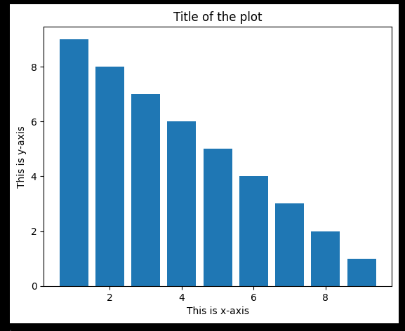
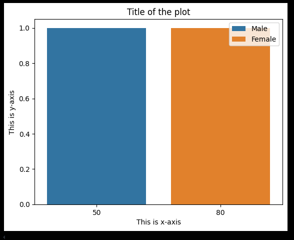
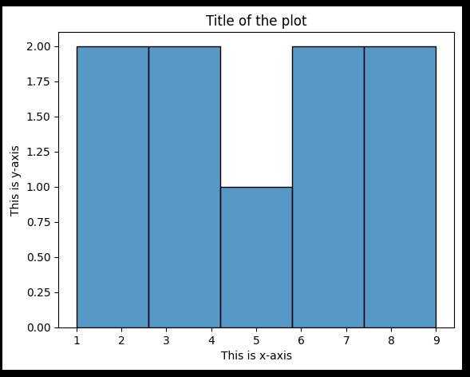

# Day 1 Assignment

## Question 1: Learn about magic commands and what they are used for

Magic commands are special commands that are designed to facilitate common tasks and enhance the interactivity of the IPython environment. 
They are prefixed with one or two percent signs (`%` or `%%`). 
Magic commands come in two flavors: line magics, which operate on a single line of input, and cell magics, which operate on multiple lines of input.

### Examples of Magic Commands

- `%lsmagic`: Lists all available magic commands.
- `%time`: Times the execution of a single statement.
- `%timeit`: Repeatedly times the execution of a single statement for more accuracy.
- `%pwd`: Returns the current working directory.
- `%cd`: Changes the current working directory.
- `%run`: Runs a Python script inside the environment.
- `%matplotlib`: Sets up the matplotlib backend for plotting.
- `%who`: Lists all variables in the current namespace.
- `%whos`: Provides detailed information about variables in the current namespace.
- `%store`: Saves variables to disk.
- `%reset`: Resets the namespace by removing all names defined by the user.
- `%%writefile`: Writes the contents of the cell to a file.
- `%%capture`: Captures the output of the cell.
- `%%time`: Times the execution of the entire cell.
- `%%timeit`: Repeatedly times the execution of the entire cell for more accuracy.

### Usage

Magic commands are used to streamline workflows, perform system tasks, and enhance the functionality of IPython and Jupyter notebooks. 
They are also useful for data analysis, visualization, and debugging.

## Question 2: Difference between a Bar Chart, Count Plot, and Histogram

### Bar Chart

A bar chart is a graphical representation of categorical data with rectangular bars. 
The length of each bar is proportional to the value it represents. Bar charts are used to compare different categories.

#### Example

### Count Plot

A count plot is a type of bar chart that displays the count of observations in each categorical bin using bars. 
It is commonly used in data analysis to show the frequency distribution of categorical variables.

#### Example

### Histogram

A histogram is a graphical representation of the distribution of numerical data. 
It groups data into bins and displays the frequency of data points in each bin. 
Histograms are used to understand the distribution and spread of continuous data.

#### Example

### Summary

- **Bar Chart**: Used for comparing different categories.
- **Count Plot**: Used for showing the frequency distribution of categorical variables.
- **Histogram**: Used for displaying the distribution of continuous data.

