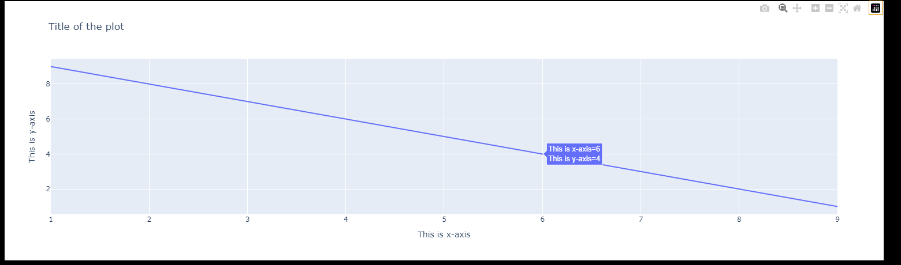
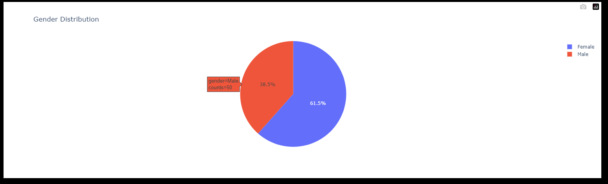
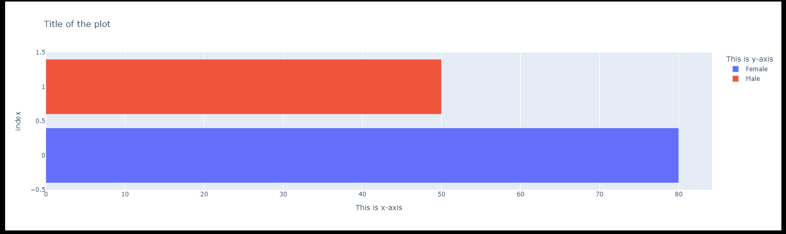
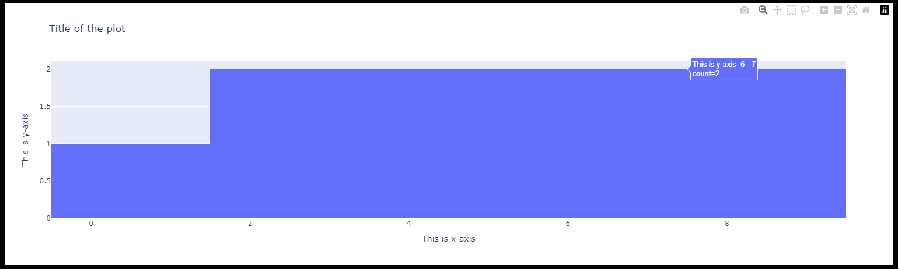
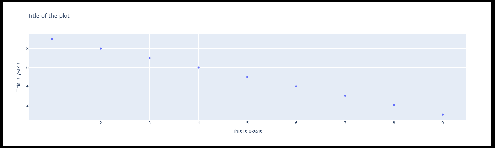
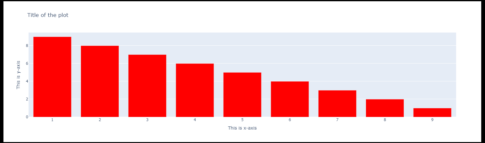
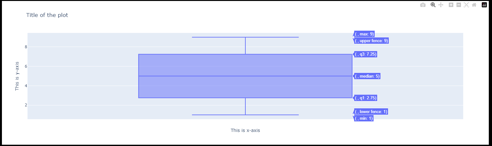

### Question 1: Do a blog on data protection, privacy and ethics

Click [here](https://medium.com/@eugenegabriel.ke/data-protection-privacy-and-ethics-cf391673f589) to access my blog on the topic.

### Question 2: Do all the visualization we learnt in plotly

## Line Plot
```python
import plotly.express as px

x = [1, 2, 3, 4, 5, 6, 7, 8, 9]  # x-axis
y = [9, 8, 7, 6, 5, 4, 3, 2, 1]  # y-axis

# Create a DataFrame
import pandas as pd
df = pd.DataFrame({'x': x, 'y': y})

fig = px.line(df, x='x', y='y', title='Title of the plot', labels={'x': 'This is x-axis', 'y': 'This is y-axis'}) # Create a line plot
fig.show() # Show the plot
```


## Pie Chart
```python
import plotly.express as px

# Data for the pie chart
gender = ['Female', 'Male']
counts = [80, 50]

df = pd.DataFrame({'gender': gender, 'counts': counts}) # Create a DataFrame
fig = px.pie(df, names='gender', values='counts', title='Gender Distribution') # Create a pie chart
fig.show() # Show the plot
```


## Count Plot
```python
import plotly.express as px

# Data for the count plot
df = pd.DataFrame({'gender': gender, 'counts': counts})

fig = px.bar(df, x='counts', color='gender', title='Title of the plot', labels={'counts': 'This is x-axis', 'gender': 'This is y-axis'}) # Create a count plot
fig.show() # Show the plot
```


## Histogram
```python
import plotly.express as px

x = [1, 2, 3, 4, 5, 6, 7, 8, 9]  # x-axis
y = [9, 8, 7, 6, 5, 4, 3, 2, 1]  # y-axis

# Data for the histogram
df = pd.DataFrame({'y': y})

fig = px.histogram(df, x='y', nbins=5, title='Title of the plot', labels={'y': 'This is y-axis'}) # Create a histogram
fig.update_layout(xaxis_title='This is x-axis', yaxis_title='This is y-axis') # Update axis labels
fig.show() # Show the plot
```


## Scatter Plot
```python
import plotly.express as px

x = [1, 2, 3, 4, 5, 6, 7, 8, 9]  # x-axis
y = [9, 8, 7, 6, 5, 4, 3, 2, 1]  # y-axis

# Data for the scatter plot
df = pd.DataFrame({'x': x, 'y': y})

fig = px.scatter(df, x='x', y='y', title='Title of the plot', labels={'x': 'This is x-axis', 'y': 'This is y-axis'}) # Create a scatter plot
fig.show() # Show the plot
```


## Bar Graph
```python
import plotly.express as px

x = [1, 2, 3, 4, 5, 6, 7, 8, 9]  # x-axis
y = [9, 8, 7, 6, 5, 4, 3, 2, 1]  # y-axis

# Data for the bar graph
df = pd.DataFrame({'x': x, 'y': y})

fig = px.bar(df, x='x', y='y', title='Title of the plot', labels={'x': 'This is x-axis', 'y': 'This is y-axis'}, color_discrete_sequence=['red']) # Create a bar graph
fig.show() # Show the plot
```


## Box Plot
```python
import plotly.express as px

x = [1, 2, 3, 4, 5, 6, 7, 8, 9]  # x-axis
y = [9, 8, 7, 6, 5, 4, 3, 2, 1]  # y-axis

# Data for the box plot
df = pd.DataFrame({'y': y})

fig = px.box(df, y='y', title='Title of the plot', labels={'y': 'This is y-axis'}) # Create a box plot
fig.update_layout(xaxis_title='This is x-axis', yaxis_title='This is y-axis') # Update axis labels
fig.show() # Show the plot
```


### Learn the different customization for each visualization

## Line Plot Customizations
```python
fig.update_traces(line=dict(color='blue', width=2, dash='dash')) # Customize line style
fig.update_layout(title='Customized Line Plot', xaxis_title='Custom X-axis', yaxis_title='Custom Y-axis') # Update layout
fig.show()
```

## Pie Chart Customizations
```python
fig.update_traces(textposition='inside', textinfo='percent+label') # Customize text position and info
fig.update_layout(title='Customized Pie Chart', showlegend=True) # Update layout
fig.show()
```

## Count Plot Customizations
```python
fig.update_traces(marker_color='green', marker_line_width=1.5) # Customize bar color and line width
fig.update_layout(title='Customized Count Plot', xaxis_title='Custom X-axis', yaxis_title='Custom Y-axis') # Update layout
fig.show()
```

## Histogram Customizations
```python
fig.update_traces(marker_color='purple', opacity=0.75) # Customize bar color and opacity
fig.update_layout(title='Customized Histogram', xaxis_title='Custom X-axis', yaxis_title='Custom Y-axis') # Update layout
fig.show()
```

## Scatter Plot Customizations
```python
fig.update_traces(marker=dict(size=12, color='red', symbol='circle')) # Customize marker size, color, and symbol
fig.update_layout(title='Customized Scatter Plot', xaxis_title='Custom X-axis', yaxis_title='Custom Y-axis') # Update layout
fig.show()
```

## Bar Graph Customizations
```python
fig.update_traces(marker_color='orange', marker_line_width=2) # Customize bar color and line width
fig.update_layout(title='Customized Bar Graph', xaxis_title='Custom X-axis', yaxis_title='Custom Y-axis') # Update layout
fig.show()
```

## Box Plot Customizations
```python
fig.update_traces(boxmean='sd', fillcolor='lightblue') # Show mean and customize fill color
fig.update_layout(title='Customized Box Plot', xaxis_title='Custom X-axis', yaxis_title='Custom Y-axis') # Update layout
fig.show()
```