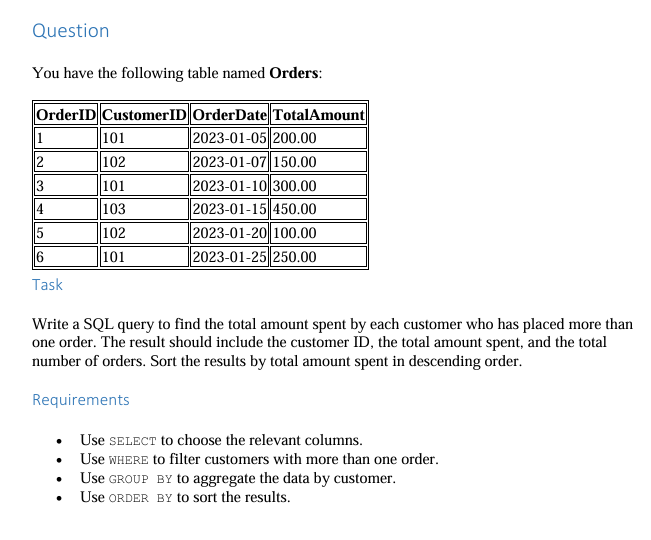

# The Question


## My answer

### 1. Creating the OnlineRetail Database
```sql
CREATE DATABASE OnlineRetail;
```

### 2. Selecting the database
```sql
USE OnlineRetail;
```

### 3. Creating the Orders table
```sql
CREATE TABLE Orders (
    OrderID INT PRIMARY KEY,
    CustomerID INT,
    OrderDate DATE,
    TotalAmount DECIMAL(10,2)
);
```
### 4. Inserting the data into the table
```sql
INSERT INTO Orders (OrderID, CustomerID, OrderDate, TotalAmount) VALUES
(1, 101, '2023-01-05', 200.00),
(2, 102, '2023-01-07', 150.00),
(3, 101, '2023-01-10', 300.00),
(4, 103, '2023-01-15', 450.00),
(5, 102, '2023-01-20', 100.00),
(6, 101, '2023-01-25', 250.00);
```

### 5. Solving the task
```sql
SELECT CustomerID, 
    SUM(TotalAmount) AS TotalSpent, 
    COUNT(OrderID) AS TotalOrders
FROM Orders
GROUP BY CustomerID
HAVING COUNT(OrderID) > 1
ORDER BY TotalSpent DESC;
```

### 6. code and Output
